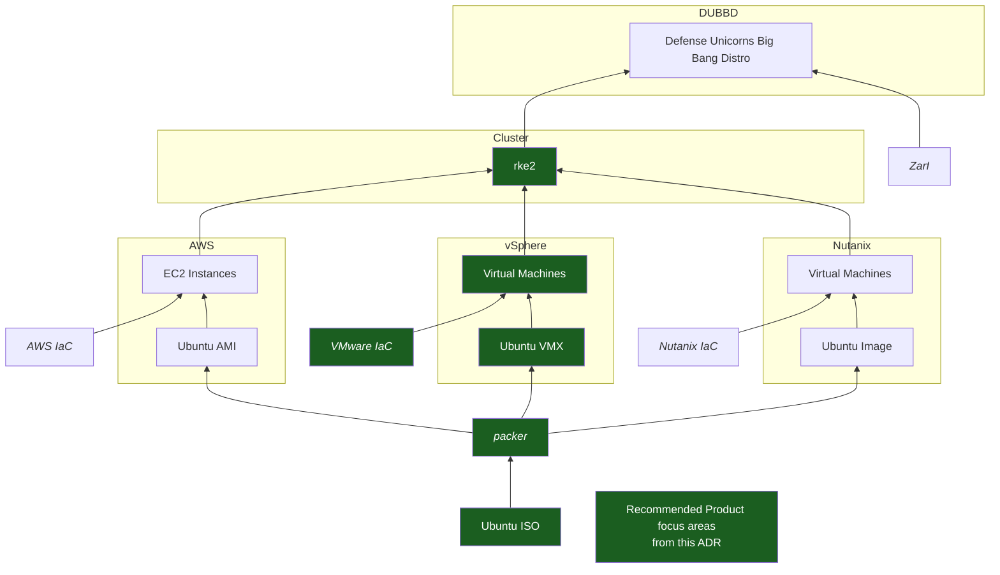

# 7. UDS On-Prem IaC and Kubernetes Solution

Date: 2023-06-22

## Status

Accepted

## Context

Our Mission Heroes are tasking us to deliver on-premises deployments. We do not have a ready-made option. Instead,
Delivery engineers build custom one-off solutions. Each team uses nuanced criteria to select best-fit technologies for
each Delivery engagement. This approach cannot scale. We anticipate on-premises deployment requests to continue to
grow. To meet this need, we will consider available options, make a firm decision, and develop a reusable
implementation in alignment with the guiding principles below.

### Guiding Principles

The decision presented here will consider the following guiding principles.

* Minimize technical diversity
  * Favor technologies already employed within the Blessing
  * Simplify onboarding for new contributors
  * Reduce maintenance, operational, and staff costs
  * Common technologies promote economies of scale
* Leverage existing Defense Unicorns projects and solutions
  * Zarf, Pepr, Lula, and existing Delivery solutions must be considered
  * Teams that suffer the, "Not Invented Here!" syndrome repeat mistakes and blindly waste resources on duplicate
    efforts
* Consider market dominance and shifts in the technical landscape
  * AWS has market dominance for cloud infrastructure, on-prem market dominance is an attractive quality
  * Popular solutions are more likely to be accepted by more Mission Heroes and tend to have a better documentation
    and support ecosystem
  * Up-and-coming technologies should also be considered, especially when they directly address shortfalls in current
    market-dominating solutions
* Use Free and Open Source Software
  * Contribute to upstream projects when possible
  * Open source our implementations for the good of humanity
  * Improve the overall security posture for the solutions we deliver
  * Reduce the operating costs for our Mission Heroes
* Built for day-two operations from day-zero
  * Configuration-driven, declarative infrastructure and Kubernetes deployment
  * Support live patching, upgrades, rollbacks, disaster recovery, and other typical day-two use cases
* Simplify end-user experience by accepting more work upfront
  * Reduce the number of manual steps to zero by owning the hard stuff
* Works with, not against, security norms
  * FIPS compliance, FISMA compliance, out-of-the-box alignment to NIST controls
* The solution will be delivered using a now, next, later approach
  * The team will focus on delivering a thin functional thread, also referred to as a Minimum Viable Product (MVP) now
  * The MVP will be complemented with additional features and capabilities next
  * The initial delivery will reach feature completeness later

## Open Questions with Proposed Answers

1. Do we assume bare metal configuration or resource virtualization?

    _Our initial on-prem solution targets virtualization_

1. Should we account for edge deployments?

    _No. Edge systems are partially supported; however, they have additional constraints and are therefore beyond the
    scope of this ADR_

    _Edge systems can be portable, may operate in austere environments, and typically have constrained access
    resources (CPU, memory, storage, network bandwidth), or formfactors (AWS Snowball, Azure Edge) that hinder
    traditional UDS deployment methodologies. Edge system deployments should be addressed in later ADR(s) as the need
    arises._

## Assessment of Alternatives

This Decision Record considers three separate but very closely linked topics: Infrastructure as Code solution, the
Operating System, and the Kubernetes Distribution. In assessing alternatives, the options for these topics are
considered separately.

### Infrastructure

|  | Open Source | Declarative | Patching / Upgrades | Rollbacks | Used in the Blessing | Notes |
| -- | :-: | :-: | :-: | :-: | :-: | -- |
| [MAAS](https://maas.io/) | :heavy_check_mark: | :heavy_check_mark: | :heavy_multiplication_x: | :heavy_multiplication_x: | :heavy_check_mark: Cyber Vertical | Automation solved in Cyber Vertical [Terraform provider available](https://github.com/maas/terraform-provider-maas) |
| [Terraform](https://www.terraform.io/) | :heavy_check_mark: | :heavy_check_mark: | :heavy_check_mark: | :heavy_multiplication_x: | :heavy_check_mark: Everywhere |  |
| [Pulumi](https://www.pulumi.com/) | :heavy_check_mark: | :heavy_check_mark: | :heavy_check_mark: | :heavy_multiplication_x: | :heavy_multiplication_x: | Supports AWS, Azure, vSphere Rich SDK for rolling your own solution(s) |
| [iPXE](https://ipxe.org/) | :heavy_check_mark: | :heavy_check_mark: | :heavy_multiplication_x: | :heavy_multiplication_x: | :heavy_multiplication_x: | Popular hardware provisioning capability  Automation possible with heavy investment in custom solution |
| [Nutanix](https://www.nutanix.com/products/hardware-platforms) | :heavy_multiplication_x: | :heavy_check_mark: | :heavy_check_mark: | :heavy_check_mark: | :heavy_multiplication_x: | Mature commerical offering [Terraform provider available](https://registry.terraform.io/providers/nutanix/nutanix/latest/docs) |
| [VMware vSphere](https://www.vmware.com/products/vsphere.html) | :heavy_multiplication_x: | :heavy_check_mark: | :heavy_check_mark: | :heavy_check_mark: | :heavy_multiplication_x: | Tanzu Kubernetes Integration [Terraform provider available](https://registry.terraform.io/providers/hashicorp/vsphere/latest/docs)  [vSphere provider available](https://www.pulumi.com/registry/packages/vsphere) |
| [ProxMox](https://www.proxmox.com/en/) | :heavy_check_mark: | :heavy_check_mark: | :heavy_multiplication_x: | :heavy_multiplication_x: | :heavy_multiplication_x: | Reputation as a hobbyist tool |

### Operating System

|  | Open Source | OS STIG Available | Patching / Upgrades / Rollbacks | Used in the Blessing | Notes |
| -- | :-: | :-: | :-: | :-: | -- |
| [Ubuntu](https://ubuntu.com/) 20.04 | :heavy_check_mark: | :heavy_check_mark: | :heavy_check_mark: | :heavy_check_mark: Cyber Vertical | Debian-based open source distribution
| [Rocky](https://rockylinux.org/) 8.7 | :heavy_check_mark: | :heavy_check_mark: | :heavy_check_mark: | :heavy_multiplication_x: | RHEL-based open source distribution from the original CentOS team RedHat recently disclosed they will no longer facilitate downstream porting of their systems
| [RedHat](https://www.redhat.com/en/technologies/linux-platforms/enterprise-linux) 8.7 | :heavy_multiplication_x: | :heavy_check_mark: | :heavy_check_mark: | :question: | Popular licensed solution in many Government and Commercial spaces RedHat recently disclosed they will no longer facilitate downstream porting of their systems |
| [Talos OS](https://www.siderolabs.com/platform/talos-os-for-kubernetes/) | :heavy_check_mark: | :heavy_multiplication_x: | :heavy_check_mark: | :heavy_multiplication_x: | Includes k8s distro and is very lightweight and secure, airgap ready

### Kubernetes Distribution

|  | Open Source | Airgapable | Used in the Blessing | Notes |
| -- | :-: | :-: | :-: | -- |
| [RKE2](https://docs.rke2.io/) | :heavy_check_mark: | :heavy_check_mark: | :heavy_check_mark: | FIPS 140-2 compliant Popular open source solution in many Government and Commercial spaces |
| [Tanzu](https://tanzu.vmware.com/tanzu) | :heavy_multiplication_x: | :heavy_check_mark: |:heavy_multiplication_x: | VMware k8s distribution Compatible with VMware vSphere |
| [OKD](https://www.okd.io/) | :heavy_check_mark: | :heavy_check_mark: | :heavy_multiplication_x: | Open source offering from RedHat, similar to OpenShift |
| [OpenShift](https://www.redhat.com/en/technologies/cloud-computing/openshift) | :heavy_multiplication_x: | :heavy_check_mark: | :heavy_multiplication_x: | Populare licensed solutions in many Government and Commercial spaces |
| [EKS Anywhere](https://aws.amazon.com/eks/eks-anywhere/) | :heavy_check_mark: | :heavy_check_mark: | :question: | Official Open Source port of Amazon's EKS offering
| [Charmed k8s](https://ubuntu.com/kubernetes/charmed-k8s_) | :heavy_check_mark: | :question: | :heavy_multiplication_x: | Canonical's k8s distribution Compatible with MAAS |
| [microk8s](https://github.com/canonical/microk8s) | :heavy_check_mark: | :heavy_check_mark: | :heavy_multiplication_x: | Canonical's minimal k8s distribution
| [Platform9](https://platform9.com/) | :heavy_multiplication_x: | :question: | :heavy_multiplication_x: | SaaS management
| [Upstream](https://kubernetes.io/) (roll our own) | :heavy_check_mark: | :heavy_check_mark: | :heavy_multiplication_x: | Requires significant engineering to perfect |

## Decision

Our on-premises IaC will consist of a customized Ubuntu base image with RKE2 pre-installed, vSphere from VMware for
Virtual Machine provisioning and management, and RKE2 as the Kubernetes distribution.

* Packer will be used to iteratively develop the Ubuntu base image
  * Ubuntu will be STIG'd and have RKE2 pre-installed
  * The STIG'd Ubuntu can be made available for other uses as needed (base VMs for KubeVirt, developer images, etc)
* Terraform will be used to provision on-prem virtualized infrastructure through the VMware provider
  * The Terraform provider will configure the RKE2 cluster through cloud-init user data and VM labels
  * The Terraform Nutanix provider is an attractive option if we need to support Nutanix down the road without
  introducing another tool
  * Similarly, the Terraform MAAS provider is an attractive option if we need to support bare metal provisioning down
  the road without introducing another tool

### Next Steps

Next steps include, but are not limited to

* Produce an opinionated Ubuntu image via CI/CD pipeline
  * Source from upstream Ubuntu 20.04 ISO
  * Publish AWS AMI and VMware VMX image
* Develop opinionated VMware Terraform capability
* Automate cluster configuration with user data

## Consequences

Evolving to support another Linux distribution may prove challenging. By selecting Ubuntu, we will uncover and resolve
issues specific to Debian lineage Linux distributions that might not translate well to Red Hat Enterprise Linux
pedigree (Rocky Linux, Fedora Linux, etc.).

We are ignoring Infrastructure that runs on bare metal. Pivoting to bare metal will require new technologies (ie:
MAAS) into the stack and require significant resource investment.

We are ignoring non-VMware hypervisor solutions (ie: Nutanix). Though our chosen path makes supporting additional
virtualization platforms easier, we will need to invest significant resources for each new hypervisor.

A core tenet of Defense Unicorns (and the fourth Guiding Principle from this document) is to make, leverage, and
contribute back to Free and Open Source Software whenever feasible. The chosen solution in this ADR relies explicitly
on vSphere, a commercial hypervisor with a real license cost. We believe this path forward aligns more closely with
current market trends and any associated costs are palletable by our Mission Heroes.
