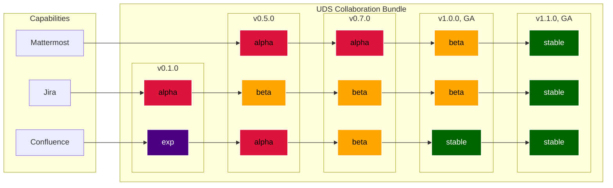

# 10. UDS Bundle Definition with Release Life Cycle

Date: 2023-08-08

## Status

Accepted

Supercedes [9. UDS Package Definition with Maturity Levels](0009-uds-package-definition-with-maturity-levels.md)

## Context

Our organization established a standard for UDS Bundles: hosted on "our" registry, supported by Product, with an unspoken requirement that it is secure and reliable.

This record codifies characteristics of UDS Bundles and Capabilities through the lens of the Software Release Life Cycle.

### Notes

* *UDS Package* is renamed *UDS Bundle*. The term Package is overloaded and can be confused with Zarf Package
* *Experimental, Alpha, Beta, Stable, and End-of-Life* labels only apply to UDS Capabilities
* *General Availability* determination only applies to bundles

## Decision

UDS Capabilities will follow widely accepted release label progression of Experimental, Alpha, Beta, Stable, and End-of-Life.

UDS Bundles' release label (if one is applied) or "General Availability" status will be determined by the Vice President of Product.

End-of-Life decisions will be made at the discretion of the Vice President of Product.

### Definitions

| Term | Definition |
| -- | -- |
| UDS Bundle | comprised of one or more UDS Capabilities |
| General Availability | a UDS Bundle that satisfies an internally developed standard and is ready to ship to production |
| UDS Capability | a tool selected to perform a specific function |
| Software Release Life Cycle | process of developing, testing, and distributing software through progressive stages |
| Experimental | under active development, user-facing APIs may change use with extreme caution, preferably in non-production environments |
| Alpha | not feature complete early preview stage not thoroughly tested, documented, or supported |
| Beta | feature complete fully automated end-to-end testing ready for testing outside the organization missing or incomplete day 2 automation limited or no security control mapping (OSCAL) |
| Stable | no known limitations day 2 automation complete security control mapping (OSCAL) |
| End-of-Life | UDS Bundles or Capabilities that are no longer supported |

### Qualities of Alpha, Beta, and Stable Labels

The following table represents a 95% complete solution for determining the release label for Capabilities.

|  | Experimental | Alpha | Beta | Stable |
| -- | -- | :-: | :-: | :-: |
| Reusable Bundle of one or more Zarf Packages |  | :heavy_check_mark: | :heavy_check_mark: | :heavy_check_mark: |
| Functional software |  | :heavy_check_mark: | :heavy_check_mark: | :heavy_check_mark: |
| Istio integration (virtual service) |  | :heavy_check_mark: | :heavy_check_mark: | :heavy_check_mark: |
| Flux CRDs |  | :heavy_check_mark: | :heavy_check_mark: | :heavy_check_mark: |
| Proper baseline documentation - readme - contributing guide - changelog - package_maintenance - code owners |  | :heavy_check_mark: | :heavy_check_mark: | :heavy_check_mark: |
| CI / CD pipeline with limited testing (health check) |  | :heavy_check_mark: | :heavy_check_mark: | :heavy_check_mark: |
| Hardened image (Iron Bank or other trusted source) |  |  | :heavy_check_mark: | :heavy_check_mark: |
| Full DUBBD integration - Istio integration (mTLS) - SSO integration - Monitoring integration (service monitor, dashboards) - Network Policies - Kyverno policies |  |  | :heavy_check_mark: | :heavy_check_mark: |
| CI / CD pipeline End-to-End integration and usability tests - Exercise like end-user - Uses Cypress, Gluon, etc |  |  | :heavy_check_mark: | :heavy_check_mark: |
| Database / object storage configured |  |  | :heavy_check_mark: | :heavy_check_mark: |
| High Availability application configuration |  |  | :heavy_check_mark: | :heavy_check_mark: |
| Deployable over an air gap |  |  | :heavy_check_mark: | :heavy_check_mark: |
| Automated patching support (patches are non-breaking) |  |  | :heavy_check_mark: | :heavy_check_mark: |
| Manual backup and restore support |  |  | :heavy_check_mark: | :heavy_check_mark: |
| Automated upgrade support (upgrades are non-breaking) |  |  |  | :heavy_check_mark: |
| Automated backup and restore support |  |  |  | :heavy_check_mark: |
| Explicit control mapping in OSCAL |  |  |  | :heavy_check_mark: |

### Thought Exercises

* Can a UDS Capability satisfy some GA qualities and still be considered Alpha? **Yes**
* Can a UDS Bundle contain Capabilities at different release stages? **Yes**
* Can a UDS Bundle containing Alpha Capabilities be deployed into production? **Yes**
* Can a UDS Bundle be deployed into production if it is missing a known desired Capability? **Yes**

### Visual Walkthrough

The following is an example Collaboration Bundle development path assuming Mattermost, Jira, and Confluence capabilities.

Please note: the versions (v0.1.0, v0.5.0, etc.) are not prescriptive based on bundle contents or amount of capabilities in beta status or above. They are only provided as examples to help illustrate forward progress.

## Consequences

This decision establishes a clear standard for UDS Bundles and Capabilities by explicitly listing Experimental, Alpha, Beta, and Stable capability qualities and General Availability Bundle release expectations. We anticipate this information improving internal and external stakeholder understanding when communicating current and future states of UDS Bundles. Further, the table outlined above maps cleanly to generating engineering tasks and can be used to establish Git repository templates.

The qualities outlined above are do not satisfy all use cases. This decision outlines a minimum set. We expect capabilities will have additional features for alpha, beta, and stable that are unique to their functionality.

This decision does not prescribe patching, upgrade, or support timelines.
